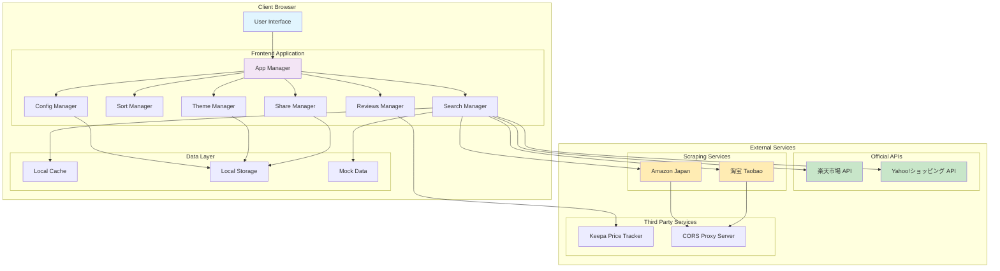
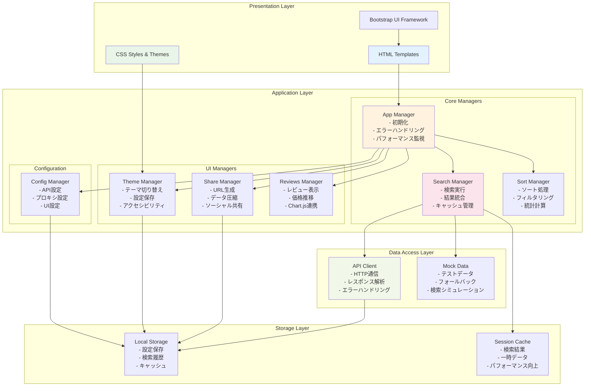
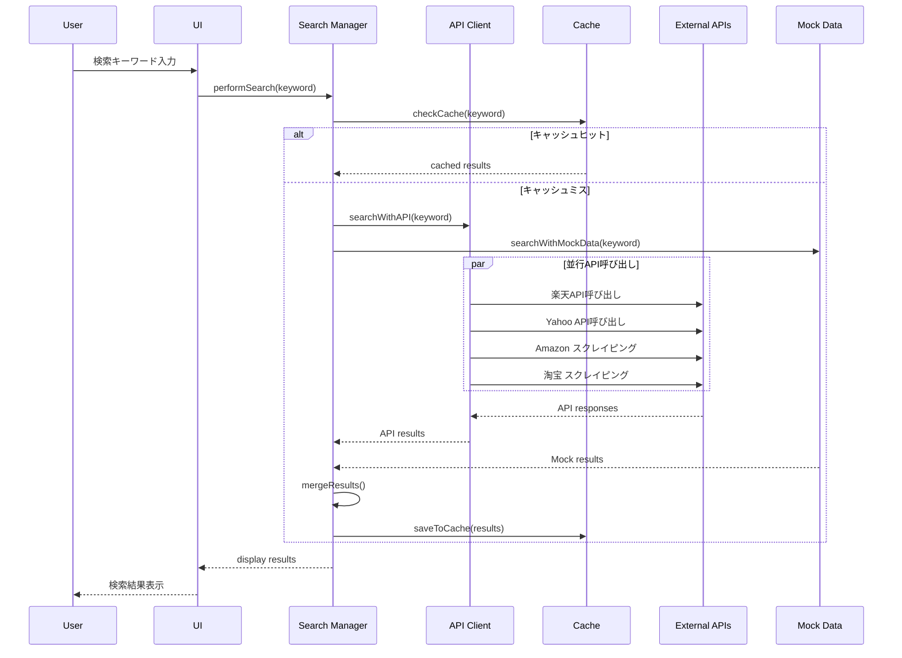
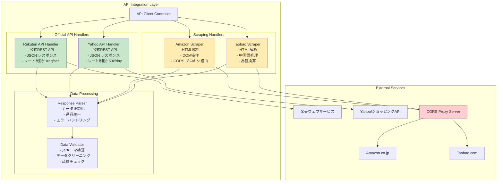
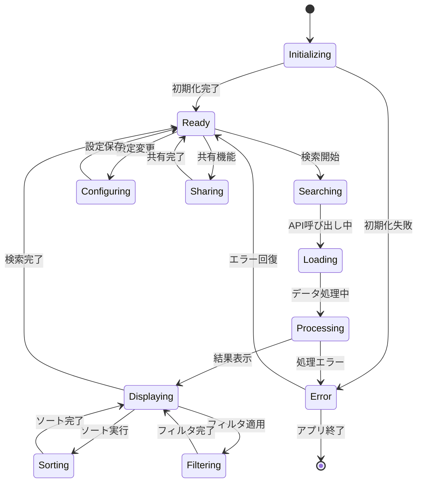
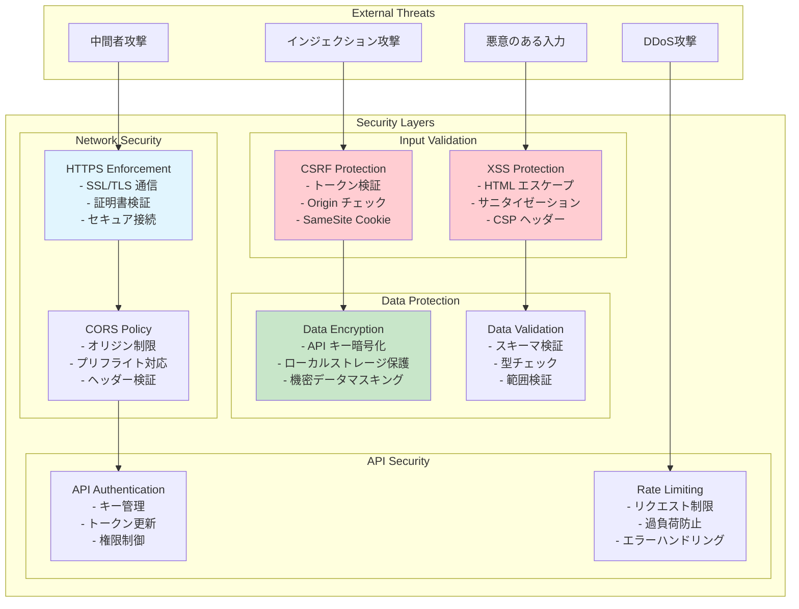
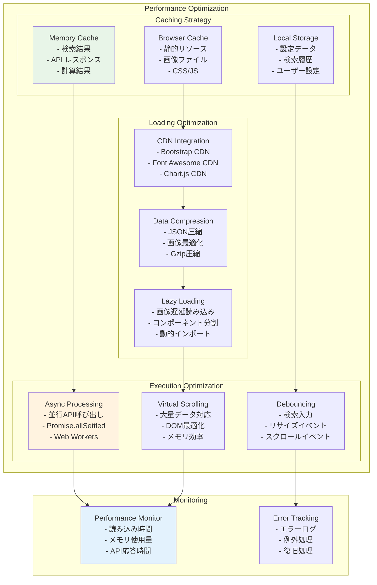

# マルチECサイト検索アプリケーション - 論理アーキテクチャ

## 概要

このドキュメントは、マルチECサイト検索アプリケーションの論理アーキテクチャを説明します。アプリケーションは、複数のECサイトから商品情報を取得し、統合された検索結果を提供するWebアプリケーションです。

## システム全体アーキテクチャ

## コンポーネント詳細アーキテクチャ

## データフローアーキテクチャ

## API統合アーキテクチャ

## 状態管理アーキテクチャ

## セキュリティアーキテクチャ

## パフォーマンス最適化アーキテクチャ

## 技術スタック詳細

### フロントエンド技術
- **HTML5**: セマンティックマークアップ、アクセシビリティ対応
- **CSS3**: Flexbox、Grid、カスタムプロパティ、メディアクエリ
- **JavaScript (ES6+)**: モジュール、Promise、async/await、クラス構文
- **Bootstrap 5**: レスポンシブUI、コンポーネント、ユーティリティ
- **Chart.js**: 価格推移グラフ、データ可視化
- **Font Awesome**: アイコンフォント、UI装飾

### データ管理
- **LocalStorage**: 設定データ、検索履歴の永続化
- **SessionStorage**: 一時的なキャッシュデータ
- **Memory Cache**: 高速アクセス用インメモリキャッシュ

### 外部連携
- **REST API**: 楽天、Yahoo!の公式API
- **Web Scraping**: Amazon、淘宝のデータ取得
- **CORS Proxy**: クロスオリジン制限の回避
- **Keepa API**: Amazon価格追跡サービス

## アーキテクチャの特徴

### 1. **モジュラー設計**
- 各機能を独立したマネージャークラスで実装
- 疎結合な設計により保守性を向上
- 機能追加・変更時の影響範囲を最小化

### 2. **ハイブリッドデータ取得**
- 公式APIとスクレイピングの併用
- フォールバック機能による可用性確保
- モックデータによる開発・テスト支援

### 3. **パフォーマンス重視**
- 並行処理による高速検索
- 多層キャッシュによる応答性向上
- 遅延読み込みによるリソース最適化

### 4. **ユーザビリティ**
- レスポンシブデザイン
- アクセシビリティ対応
- 直感的なUI/UX

### 5. **拡張性**
- 新しいECサイトの追加が容易
- 機能拡張のためのフック機能
- 設定可能なアーキテクチャ

## 今後の拡張計画

### 短期的改善
- Web Workers による重い処理の分離
- Service Worker によるオフライン対応
- Progressive Web App (PWA) 化

### 中期的改善
- バックエンドAPI の構築
- データベース連携
- ユーザー認証機能

### 長期的改善
- マイクロサービス化
- クラウドネイティブ対応
- AI/ML による推薦機能